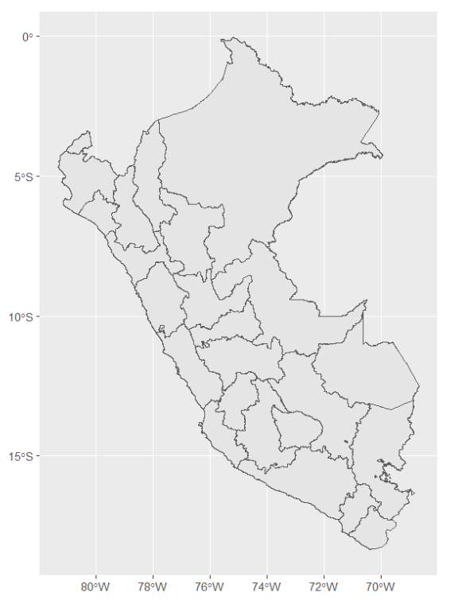
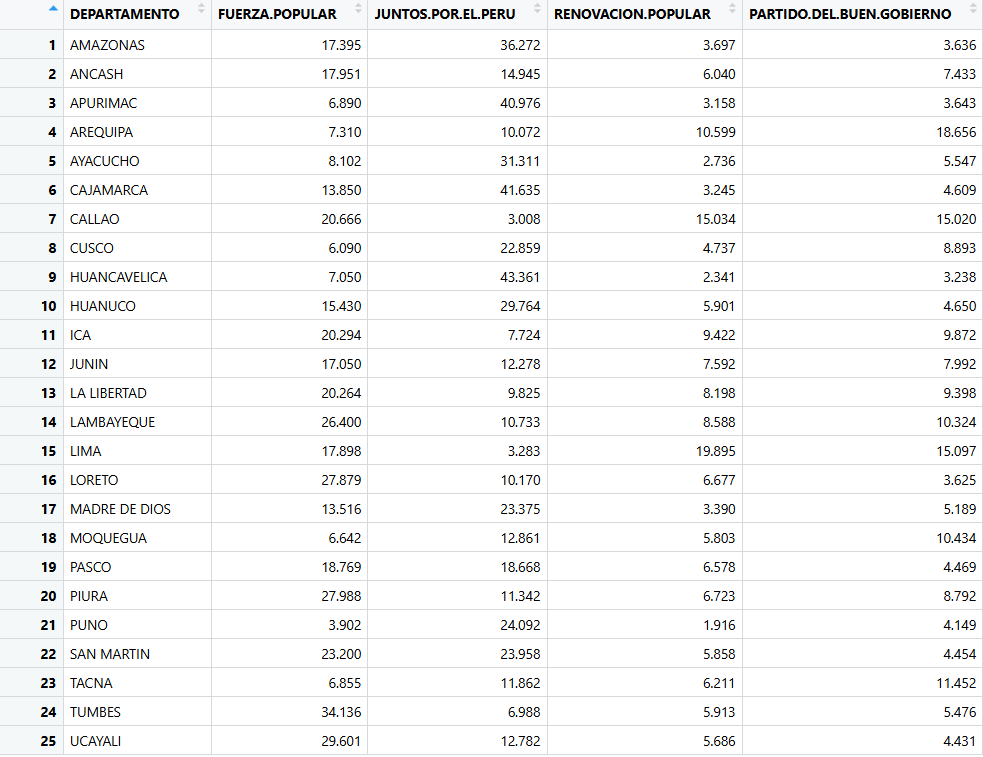
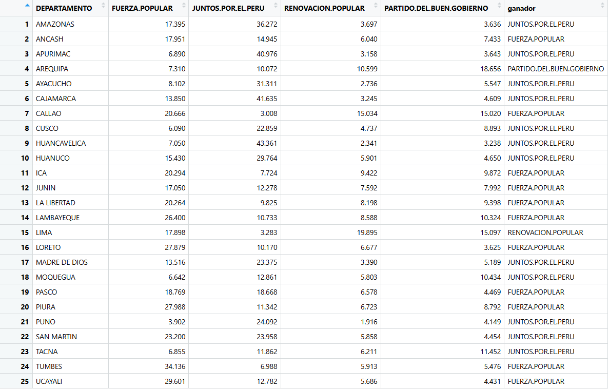
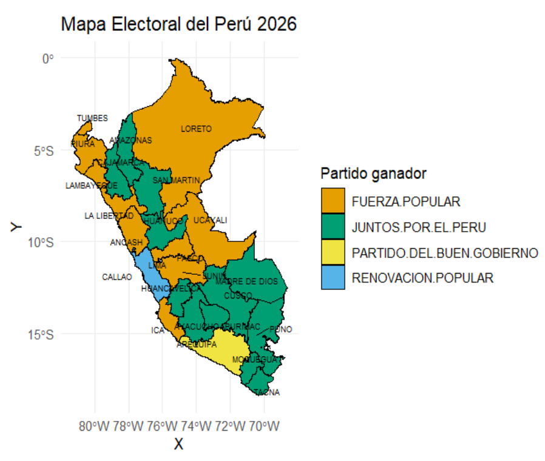

# Mapa-De-Calor-Peru-Elecciones-2026
Mapa de calor del Perú basado en resultados electorales por departamento usando R, sf y ggplot2.
## Objetivo
El objetivo de este trabajo es elaborar un mapa del Perú por departamentos utilizando datos de las elecciones 2026 y un archivo shapefile.
## 📊 Datos utilizados
Se emplearon datos de resultados electorales por departamento de 4 partidos políticos en especial: Fuerza popular, Juntos por el Perú, Partido del Buen Gobierno y Renovación popular (con fines académicos) .
## 🗺️ Metodología

### 1. Cargar librerías
```r
library(sf)
library(dplyr)
library(ggplot2)
```
### 2. Cargar archivo shapefile
Este archivo fue obtenido de la página GEO GPS PERÚ. Se utilizó el límite departamental (INEI)
```r
dirmapas <- "C:/Users/USER/Desktop/Rstudio/Bioestadística/Mapa de calor" 
setwd(dirmapas)
peru_d <- st_read("DEPARTAMENTOS_inei_geogpsperu_suyopomalia.shp")
```
El mapa del Perú se logrará ver con el siguiente código
```r
ggplot(data = peru_d) +
  geom_sf()
```


### 3. Base de datos
En este caso, he considerado cuatro partidos políticos. Esta base de datos es elaboración propia y está en formato csv para poder trabajarlo en R 
```r
datos <- read.csv("elecciones2026.csv", sep = ";", dec = ".")
head(datos)
```


### 4. Elegir al partido ganador por departamento
Para identificar el partido con mayor porcentaje de votos en cada departamento, se utilizó la función `which.max`, que permite encontrar el valor máximo en cada fila.
```r
datos$ganador <- apply(datos[,2:5], 1, function(x) {
  colnames(datos[,2:5])[which.max(x)]
})
```
De esta manera en nuestra base de datos, por cada departamento habrá un partido ganador. Este partido ganador es el que estará en el mapa de calor.



### 5. Integración de datos con el mapa
En esta etapa, se unieron los datos electorales con el shapefile del Perú utilizando el nombre del departamento como variable de unión.
```r
mapa_final <- left_join(peru_d, datos,
                       by = c("NOMBDEP" = "DEPARTAMENTO"))
```
### 6. Elaboración del mapa de calor
Finalmente, se generó el mapa de calor utilizando la librería ggplot2, asignando un color distinto a cada partido político según el ganador en cada departamento.
```r
ggplot(mapa_final) +
  geom_sf(aes(fill = ganador), color = "white", size = 0.3) +
  scale_fill_manual(values = c(
    "FUERZA.POPULAR" = "#F4A261",
    "JUNTOS.POR.EL.PERU" = "#2A9D8F",
    "RENOVACION.POPULAR" = "#457B9D",
    "PARTIDO.DEL.BUEN.GOBIERNO" = "#E9C46A"
  )) +
  labs(title = "Mapa Electoral del Perú 2026",
       fill = "Partido ganador") +
  theme_minimal()
```
### 7. Añadir etiquetas de los departamentos
Para mejorar la interpretación del mapa, se añadieron etiquetas con los nombres de los departamentos. Para ello, se calcularon puntos dentro de cada región usando la función `st_point_on_surface`.
Luego, se utilizaron las coordenadas de estos puntos para posicionar los nombres mediante la función `geom_text_repel`, la cual permite evitar que las etiquetas se superpongan.
```r
# Crear puntos dentro de cada departamento
puntos <- st_point_on_surface(mapa_final)

# Sacar coordenadas X e Y para las etiquetas
coords <- st_coordinates(puntos)
puntos$X <- coords[,1]
puntos$Y <- coords[,2]

ggplot(mapa_final) +
  geom_sf(aes(fill = ganador), color = "black", size = 0.2) +
  geom_text_repel(
    data = puntos,
    aes(x = X, y = Y, label = NOMBDEP),
    size = 2,
    max.overlaps = 25
  ) +
  scale_fill_manual(values = c(
    "FUERZA.POPULAR" = "#E69F00",
    "JUNTOS.POR.EL.PERU" = "#009E73",
    "RENOVACION.POPULAR" = "#56B4E9",
    "PARTIDO.DEL.BUEN.GOBIERNO" = "#F0E442"
  )) +
  labs(title = "Mapa Electoral del Perú 2026",
       fill = "Partido ganador") +
  theme_minimal()
```
El resultado final es el siguiente:


